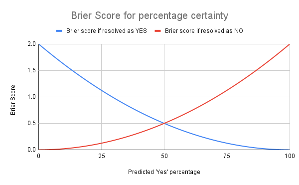

# Polar forecasts and Brier scores

Imagine your Brier score is currently 0.5 and you've answered 50 questions.
If you set 0% Yes:
-And it resolves as Yes your brier score will decrease to 0.49 (improved by 2%)
-And it resolves as No your brier score will increase to 0.529412 (5.88% worse)
If you set 5% Yes and the question resolves as 'No'
-And it resolves as Yes your brier score will improve to 0.490294 (improved by 1.995%)
-And it resolves as No your brier score will increase to 0.525588(5.12% worse)

i.e. by changing from 5% -> 0% chance, you improve your score by a further 0.005% if you're correct, but damage it by a further 0.76% if wrong.

Below is a chart illustrating the effect visually

Percentage certainty | Brier score if resolved as YES | Brier score if resolved as NO
------------- | ------------- | -------------
0 | 2 | 0
1 | 1.9602 | 0.0002
2 | 1.9208 | 0.0008
3 | 1.8818 | 0.0018
4 | 1.8432 | 0.0032
5 | 1.805 | 0.005
6 | 1.7672 | 0.0072
7 | 1.7298 | 0.0098
8 | 1.6928 | 0.0128
9 | 1.6562 | 0.0162
10 | 1.62 | 0.02
11 | 1.5842 | 0.0242
12 | 1.5488 | 0.0288
13 | 1.5138 | 0.0338
14 | 1.4792 | 0.0392
15 | 1.445 | 0.045
16 | 1.4112 | 0.0512
17 | 1.3778 | 0.0578
18 | 1.3448 | 0.0648
19 | 1.3122 | 0.0722
20 | 1.28 | 0.08
21 | 1.2482 | 0.0882
22 | 1.2168 | 0.0968
23 | 1.1858 | 0.1058
24 | 1.1552 | 0.1152
25 | 1.125 | 0.125
26 | 1.0952 | 0.1352
27 | 1.0658 | 0.1458
28 | 1.0368 | 0.1568
29 | 1.0082 | 0.1682
30 | 0.98 | 0.18
31 | 0.9522 | 0.1922
32 | 0.9248 | 0.2048
33 | 0.8978 | 0.2178
34 | 0.8712 | 0.2312
35 | 0.845 | 0.245
36 | 0.8192 | 0.2592
37 | 0.7938 | 0.2738
38 | 0.7688 | 0.2888
39 | 0.7442 | 0.3042
40 | 0.72 | 0.32
41 | 0.6962 | 0.3362
42 | 0.6728 | 0.3528
43 | 0.6498 | 0.3698
44 | 0.6272 | 0.3872
45 | 0.605 | 0.405
46 | 0.5832 | 0.4232
47 | 0.5618 | 0.4418
48 | 0.5408 | 0.4608
49 | 0.5202 | 0.4802
50 | 0.5 | 0.5
51 | 0.4802 | 0.5202
52 | 0.4608 | 0.5408
53 | 0.4418 | 0.5618
54 | 0.4232 | 0.5832
55 | 0.405 | 0.605
56 | 0.3872 | 0.6272
57 | 0.3698 | 0.6498
58 | 0.3528 | 0.6728
59 | 0.3362 | 0.6962
60 | 0.32 | 0.72
61 | 0.3042 | 0.7442
62 | 0.2888 | 0.7688
63 | 0.2738 | 0.7938
64 | 0.2592 | 0.8192
65 | 0.245 | 0.845
66 | 0.2312 | 0.8712
67 | 0.2178 | 0.8978
68 | 0.2048 | 0.9248
69 | 0.1922 | 0.9522
70 | 0.18 | 0.98
71 | 0.1682 | 1.0082
72 | 0.1568 | 1.0368
73 | 0.1458 | 1.0658
74 | 0.1352 | 1.0952
75 | 0.125 | 1.125
76 | 0.1152 | 1.1552
77 | 0.1058 | 1.1858
78 | 0.0968 | 1.2168
79 | 0.0882 | 1.2482
80 | 0.08 | 1.28
81 | 0.0722 | 1.3122
82 | 0.0648 | 1.3448
83 | 0.0578 | 1.3778
84 | 0.0512 | 1.4112
85 | 0.045 | 1.445
86 | 0.0392 | 1.4792
87 | 0.0338 | 1.5138
88 | 0.0288 | 1.5488
89 | 0.0242 | 1.5842
90 | 0.02 | 1.62
91 | 0.0162 | 1.6562
92 | 0.0128 | 1.6928
93 | 0.0098 | 1.7298
94 | 0.0072 | 1.7672
95 | 0.005 | 1.805
96 | 0.0032 | 1.8432
97 | 0.0018 | 1.8818
98 | 0.0008 | 1.9208
99 | 0.0002 | 1.9602
100 | 0 | 2
